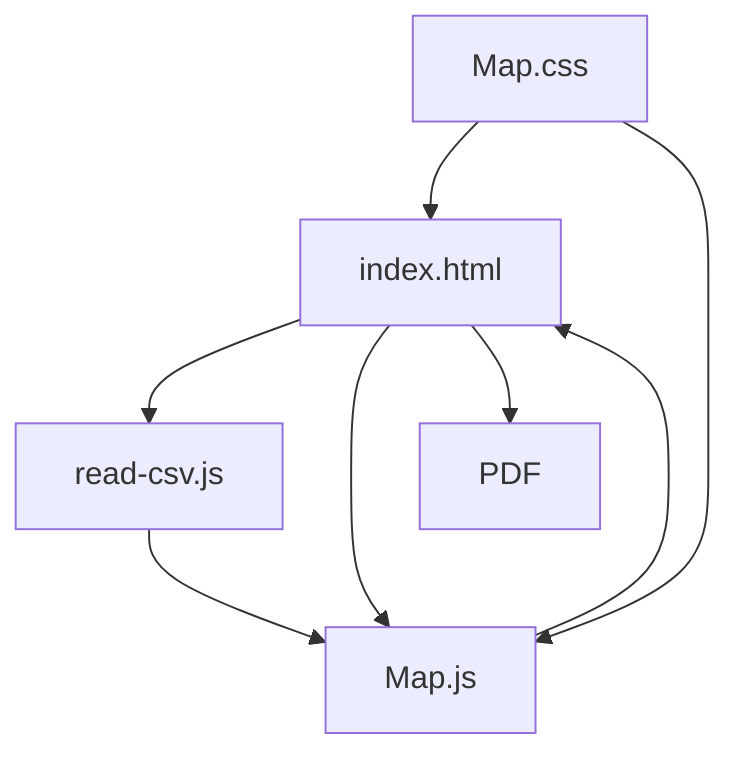

# Averitt Express Visualization of Freight Shipping
## Quick Overview:

### Requirements: 2 CSV files

        1) CSV file that contains the cities that are used

        2) CSV file that contains information of shipments between the cities (empty loads)

Output: pdf downloadable map that visualizes empty load information for cities

### Longer Description:
This program visualizes empty freight shipments across the U.S. based on provided data. Two CSV files are needed: the first with the cities that are visited, and the second which depicts information of shipments between the cities. With the provided information from both files, the program creates a map that is displayed on the screen. The map can be rebuilt with a newly provided CSV file. The user can adjust the view of the map by either hovering over the map with the mouse to zoom or clicking and dragging on the map to adjust the view. The map can be downloaded as a PDF based on the current view of the map.
## Overall Description
### Libraries in used:

    D3: Version 4

    d3-scale-chromatic

    html2pdf

    FileReader

    
### Flow of Data

## Downloading and Running Program 
1) Download the repository.

2) Extract the whole zip file.

3) Open index.html to run the program (browser window will open).

## Third Parties Tools
For Visualization:
D3.js

https://d3js.org/

## Index.html

   This file acts like our main() function, because the interface is built from this file, and all 3rd party libraries needed for the software are included here. Once you run Index.html in the browser, you will notice several buttons towards the top of the page. First, you need to click the button labeled "City File" and select the CSV file that contains the geo coordinates. Afterwards, you will need to select the button "Empty Balance file" where you upload the CSV file containing the shipment information. Once these two steps are completed, hit the "build map" button to render the visualization. If needed, you can use the scroll wheel to zoom in and out on the map. Additionally, by selecting checkboxes, you can change what is rendered the next time you press the Build map button. In addition, once the map is built you can hover over city nodes to grab information about them that aren't displayed directly on the map. This tooltip will not be rendered at first, but once you hover over a city node, it will appear below the map. Lastly, once you have found the perfect visualization that you were looking for, you can select the "Download Map" button which will save that exact view of the map in pdf format.

## read-csv.js
The read-csv.js file has the task of converting CVS files into readable data to create a map. This file provides the paths of the two CSV files where one of them contains the cities and the other contains the routes between them. This program uses the FileReader library to open the CSV files and read the contents. The data that is read is then turned into a directory that is used to create the map. 

        Function: handleFiles
        Paramaters: files, type
        Return: None
        Description: Checks if the brower supports FileReader. If supported the program moves to getAsTextCites. 
        If FileReader is not supported then alert will pop up.

        Function: getAsText
        Paramaters: filesToRead, type
        Return: None
        Description: The functions create an instance of the FileReader library. Which controls the functions used on loading a file and error handling done by FileReader.

        Function: loadHandlerCites
        Paramaters: event
        Return: None
        Description: Turns the event (CVS file) into readable text. Then passes it on to processDataAsObj and stores the result in citiesData.

        Function: loadHandlerLines
        Paramaters: event
        Return: None
        Description: Turns the event (CVS file) into readable text. Then passes it on to processDataAsObj and stores the result in linesData.

        Function: processDataAsObj
        Paramaters: csv
        Return: lines
        Description: Turns the data provided by the CVS into a directory. Then returns the final result.

        Function: drawOutputAsObj
        Paramaters: lines
        Return: None
        Description: Bug testing (Remove in final product)

        Function: getCities
        Paramaters: None
        Return: city
        Description: Retrieve the directory of cities from read-cvs.js

        Function: getLines
        Paramaters: None
        Return: linesData
        Description: Retrieve the directory of lines from read-cvs.js

        Function: emptyData
        Paramaters: None
        Return: None
        Description: Clearout all the data in lines and cities.

## Map.js
The main job of Map.js is to create a map based on the data provided and turn the map into pdf. The program creates the map by first depicting a visual representation of the United States. Then the data from the CSV files is used to create the lines between cities and create the actual city located on the map. After the map is created, the program enables the feature that allows the user to zoom and move on the map by clicking and dragging. Once the map is built it can be download as a pdf based on the current view. The view can reset by hitting the build map button.

      Function: makeMap
      Paramaters: None
      Return: None
      Description: This function removes the old map on the web browers 
      and starts the propuse of creating a new map.

      Function: resetMap
      Paramaters: None
      Return: None
      Description: Resets the scale and location of the map back to the default - without recreating the map.

      Function: downloadFile
      Paramaters: None
      Return: Downloads a pdf file named Map.pdf
      Description: This functions finds the html div with ID of MapContainer. Then it turns the html into a jpeg which is 
      downloadable as a pdf.

      Function: checkboxAlert
      returns: None
      Description: takes checkbox event of toggle arrow render in keymap function and enables checkbox
      to toggle render for lines if arrow render has been disabled.

      Function: get_cities_data
      Paramaters: None
      Return: Directory of the cities of the provided file.
      Description: Retrieves the data of cities from the Read-cvs file.

      Function: get_lines_data
      Paramaters: None
      Return: Directory of lines objects
      Description: Retrieves the data of lines from the Read-cvs file.

      Function: draw_city
      Paramaters: cities
      Return: None
      Description: The function displays the cities on a map with a red dot based on the paramater of cities. 
      Then it creates a tool tip that display the details about a city by hovering the mouse over the bottom of the map.

      Function: draw_lines
      Paramaters: data
      Return: None
      Description: Creates the lines, arrows, and empties on the map. This is done based on the data provided.

      Function: data
      Paramaters: error, topo
      Return: None
      Description: Creates the map and runs the other function to develop the map.

      Function: zoomed
      Paramaters: None
      Return: None
      Description: Adjusts the elements on the map to fit the current zoom scale.

